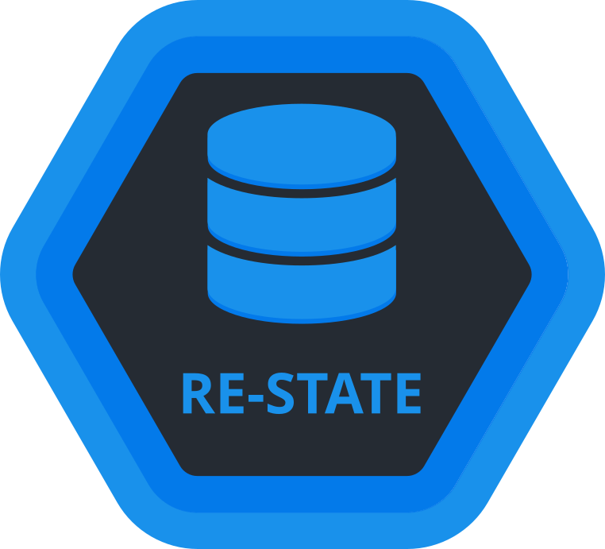

<div align="center">
  
  <br />
  <br />
  <a href="https://github.com/raulpesilva/re-state/blob/master/LICENSE">
    
  </a>
  
  <a href="https://www.npmjs.com/package/@raulpesilva/re-state">
    
  </a>
  <a href="https://www.npmjs.com/package/@raulpesilva/re-state">
    
  </a>
  <p>Share state across React and React Native without adding a provider.</p>
</div>

re-state gives shared state the familiar shape of React's `useState`. Give a value a key, and every component using
that key stays in sync. There is no provider, reducer, or context wrapper to configure.

## When it fits

re-state is a good fit when:

- Unrelated components should share one application-wide value.
- Code outside React needs to read or update that value.
- You want the same small, typed API in React and React Native.

If each provider should own a separate instance, or state must be isolated per server request, React Context may fit
better. See [Context or re-state?](https://restate.vercel.app/docs/getting-started/tradeoff).

## Install

Use the package manager already configured in your application:

```sh
npm install @raulpesilva/re-state
pnpm add @raulpesilva/re-state
yarn add @raulpesilva/re-state
bun add @raulpesilva/re-state
```

re-state supports React 16.8 and newer. React DOM is an optional peer dependency for web applications; React Native
uses the package's native export automatically.

## Quick start

`useReState` returns the same `[value, setValue]` tuple as `useState`:

```tsx
import { useReState } from '@raulpesilva/re-state';

export function Counter() {
  const [count, setCount] = useReState('count', 0);
  return <button onClick={() => setCount((previous) => previous + 1)}>Count: {count}</button>;
}
```

Another component using `count` reads and updates the same value. The first use stores its initial value; later calls
join that state instead of replacing it.

## Grow into a state module

When state has actions or is used throughout a feature, define it once with `createReStateMethods`:

```ts
// states/counter.ts
import { createReStateMethods } from '@raulpesilva/re-state';

export const { useCounter, useCounterSelect, dispatchCounter, getCounter, resetCounter } = createReStateMethods(
  'counter',
  0
);

export const increment = (): void => {
  dispatchCounter((previous) => previous + 1);
};
```

The module owns the key and initial value. Components import the named hook or action they need, while the generated
dispatcher and getter also work outside React.

## What to know

- One key identifies one value in the current JavaScript runtime.
- Updates replace the current value. Return a new object or array when changing structured state.
- A server runtime can outlive a request, so request-specific state needs proper isolation.

The [documentation](https://restate.vercel.app/docs) covers selectors, individual factories, subscriptions, reset
behavior, and complete examples.

## Examples

The workspace includes web examples for [Vite with JavaScript](examples/vite-js),
[Vite with TypeScript](examples/vite-ts), and [Next.js](examples/nextjs), plus native examples for
[Expo](examples/expo), [React Native Windows](examples/react-native-windows), and
[React Native macOS](examples/react-native-macos).

See the [examples guide](examples/README.md) for commands and platform requirements.

## Development

The repository requires Node.js 22.18 or newer and pnpm 11.7.0.

```sh
pnpm install
pnpm check
pnpm examples:check
```

`pnpm check` runs formatting, linting, strict TypeScript checking, tests, and the library build. The documentation site
has its own commands in [`docs/README.md`](docs/README.md).

## License

[MIT](LICENSE) © Raul Pereira da Silva
