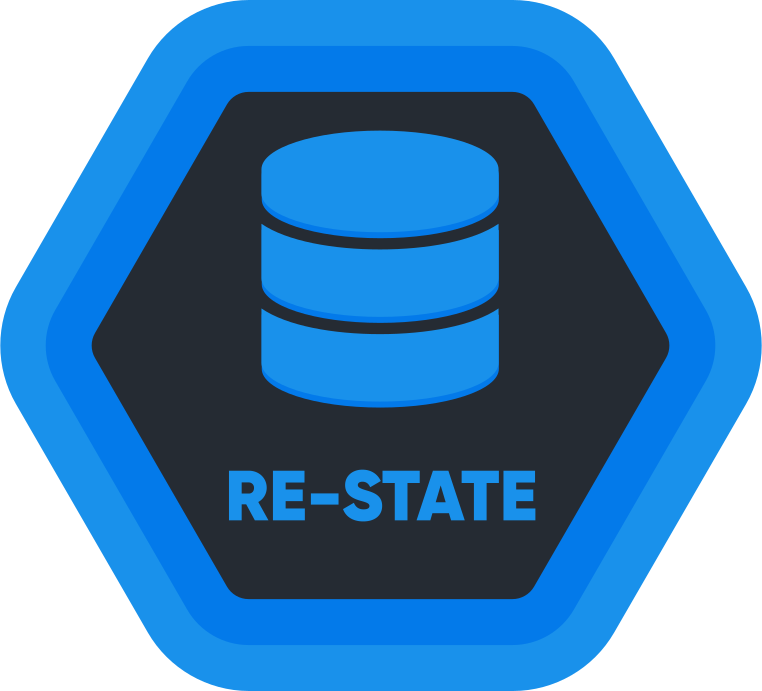

<div align="center">
  
  <br/>
  <br/>
  <a href="https://github.com/raulpesilva/re-state/blob/master/LICENSE">
    
  </a>
    
  <a href="https://www.npmjs.com/package/@raulpesilva/re-state">
    
  </a>
  <a href="https://www.npmjs.com/package/@raulpesilva/re-state">
    
  </a>
  <a href="https://www.npmjs.com/package/@raulpesilva/re-state">
    
  </a>
  <a href="https://bundlephobia.com/result?p=@raulpesilva/re-state@latest" target="\_parent">
    
  </a>
  <a href="https://bundlephobia.com/result?p=@raulpesilva/re-state@latest" target="\_parent">
    
  </a>
  <br/>
  <br/>
  <p>Easy way to provide global state to ReactJS and React Native applications</p>
  <br/>
  <br/>

</div>

## Installation

```sh
npm install @raulpesilva/re-state
```

or

```sh
yarn add @raulpesilva/re-state
```

## Documentation

[](https://restate.vercel.app/)

## Quick Start

re-state offers two main approaches to manage global state:

| Approach | Best For |
|----------|----------|
| `useReState` | Quick prototyping, simple states |
| `createReStateMethods` | Production apps, typed states, reusable logic |

---

## Approach 1: useReState Hook

The simplest way to share state between components. Works like `useState`, but the state is global.

```tsx
import { useReState } from '@raulpesilva/re-state';

function Counter() {
  const [count, setCount] = useReState('count', 0);

  return (
    <div>
      <p>Count: {count}</p>
      <button onClick={() => setCount(count + 1)}>Increment</button>
      <button onClick={() => setCount(prev => prev - 1)}>Decrement</button>
    </div>
  );
}
```

Any component using the same key (`'count'`) will share the same state:

```tsx
function CounterDisplay() {
  const [count] = useReState('count', 0);
  return <p>Current count: {count}</p>;
}

function App() {
  return (
    <div>
      <Counter />
      <CounterDisplay /> {/* Updates when Counter changes */}
    </div>
  );
}
```

**When to use:** Quick experiments, simple shared states, or when you want minimal setup.

---

## Approach 2: createReStateMethods (Recommended)

For production apps, `createReStateMethods` provides a complete, type-safe API with all the utilities you need.

### Step 1: Define your state

```ts
// states/counter.ts
import { createReStateMethods } from '@raulpesilva/re-state';

export const {
  useCounter,        // Hook: [value, setValue]
  useCounterSelect,  // Hook: value only (read-only)
  dispatchCounter,   // Update from anywhere
  getCounter,        // Get value without subscribing
  resetCounter,      // Reset to initial value
} = createReStateMethods('counter', 0);
```

### Step 2: Use in components

```tsx
// components/Counter.tsx
import { useCounter, resetCounter } from './states/counter';

function Counter() {
  const [count, setCount] = useCounter();

  return (
    <div>
      <p>Count: {count}</p>
      <button onClick={() => setCount(prev => prev + 1)}>+</button>
      <button onClick={() => setCount(prev => prev - 1)}>-</button>
      <button onClick={resetCounter}>Reset</button>
    </div>
  );
}
```

```tsx
// components/CounterDisplay.tsx
import { useCounterSelect } from './states/counter';

function CounterDisplay() {
  const count = useCounterSelect(); // Read-only, simpler API
  return <p>Current count: {count}</p>;
}
```

**When to use:** Production applications, when you need type safety, or when you want to update state from outside components.

---

## Working with Complex State

re-state works with any value type: primitives, objects, arrays, or custom types.

```ts
// states/user.ts
import { createReStateMethods } from '@raulpesilva/re-state';

interface User {
  id: string;
  name: string;
  email: string;
  avatar: string;
}

const initialUser: User = {
  id: '',
  name: '',
  email: '',
  avatar: '',
};

export const {
  useUser,
  useUserSelect,
  dispatchUser,
  getUser,
  resetUser,
} = createReStateMethods('user', initialUser);
```

```tsx
import { useUser } from './states/user';

function UserProfile() {
  const [user, setUser] = useUser();

  const updateName = (name: string) => {
    setUser(prev => ({ ...prev, name }));
  };

  return (
    <div>
      
      <h1>{user.name}</h1>
      <input
        value={user.name}
        onChange={e => updateName(e.target.value)}
      />
    </div>
  );
}
```

---

## Creating Actions

For reusable logic, define actions alongside your state:

```ts
// states/user.ts
import { createReStateMethods } from '@raulpesilva/re-state';

interface User {
  id: string;
  name: string;
  email: string;
}

const initialUser: User = { id: '', name: '', email: '' };

export const {
  useUser,
  useUserSelect,
  dispatchUser,
  getUser,
  resetUser,
} = createReStateMethods('user', initialUser);

// Custom actions
export const updateName = (name: string) => {
  dispatchUser(prev => ({ ...prev, name }));
};

export const updateEmail = (email: string) => {
  dispatchUser(prev => ({ ...prev, email }));
};

export const fetchUser = async (userId: string) => {
  const response = await fetch(`/api/users/${userId}`);
  const user = await response.json();
  dispatchUser(user);
};
```

```tsx
import { useUserSelect, updateName, fetchUser, resetUser } from './states/user';
import { useEffect } from 'react';

function UserProfile({ userId }: { userId: string }) {
  const user = useUserSelect();

  useEffect(() => {
    fetchUser(userId);
  }, [userId]);

  return (
    <div>
      <h1>{user.name}</h1>
      <button onClick={() => updateName('New Name')}>Change Name</button>
      <button onClick={resetUser}>Logout</button>
    </div>
  );
}
```

---

## Updating State Outside React

Use `dispatch*` and `get*` to work with state outside of React components:

```ts
import { dispatchCounter, getCounter } from './states/counter';

// In an event handler
document.addEventListener('keydown', (event) => {
  if (event.key === 'ArrowUp') {
    dispatchCounter(prev => prev + 1);
  }
  if (event.key === 'ArrowDown') {
    dispatchCounter(prev => prev - 1);
  }
});

// In a utility function
function logCurrentCount() {
  console.log('Current count:', getCounter());
}

// In an async function
async function syncWithServer() {
  const count = getCounter();
  await fetch('/api/count', {
    method: 'POST',
    body: JSON.stringify({ count }),
  });
}
```

---

## Available APIs

### Hooks

| Method | Description |
|--------|-------------|
| `useReState` | Simple hook with key and initial value |
| `useReStateSelector` | Subscribe to state with a selector function |

### Factory Functions

| Method | Description |
|--------|-------------|
| `createReStateMethods` | Creates all methods at once (recommended) |
| `createReState` | Creates a typed hook for a key |
| `createReStateSelect` | Creates a read-only hook |
| `createReStateDispatch` | Creates a dispatch function |
| `createGetReState` | Creates a getter function |

### Utilities

| Method | Description |
|--------|-------------|
| `onReStateChange` | Subscribe to state changes outside React |
| `resetReState` | Reset all states to initial values |
| `setReStateInitialValue` | Set the initial value for a key |

---

## Contributing

See the [contributing guide](CONTRIBUTING.md) to learn how to contribute to the repository and the development workflow.

## License

MIT © [raulpesilva](https://github.com/raulpesilva)
